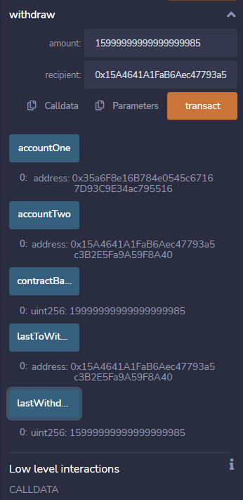

# Savings Account Smart Contract

## Technology
___
* Solidity version 0.5.0
* Remix IDE for compilation and deployment
* Ganache Local Blockchain
* Metamask for web injection

## Description
An application that allows a user to DEPOSIT and WITHDRAW from a Smart Contract Savings account
___

* User may transact with the account from any ethereum address via the DEPOSIT function

* User can only take from the account with two authorized accounts upon deployment of the smart contract via the WITHDRAW function

* Contract also has viewability functions for the balance, lastWithrawalAmount, and lastToWithdraw

## Application in Action
___
### Transaction Withdrawal to One of the approved accounts

### Viewer Functions following withdrawal to authorized account

### Ganache

### Transactions completed on smart contract 

### Calling lastToWithdraw

### Calling lastWithdrawalAmount

### Making a Deposit with Primary Account of 18eth

